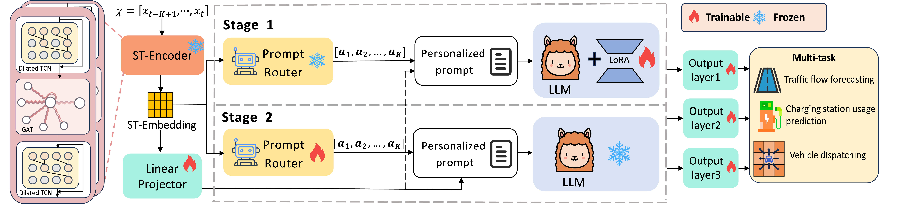

# TransLLM: A Unified Multi-Task Foundation Framework for Urban Transportation via Learnable Prompting

<!-- TODO: 将这里的图片替换为你们项目的Logo或核心架构图 -->


<p align="center">

| **[1 Introduction](#introduction)** 
| **[2 Requirements](#requirements)**
| **[3 Code structure](#code-structure)** 
| **[4 TransLLM Training](#transllm-training)** 
| **[5 TransLLM Evaluating](#transllm-evaluating)** 
| **[6 Instructions Generation](#instructions-generation)** 
| **[7 Citation](#citation)**

</p>

<a id="introduction"></a>

## 1 Introduction
Official code for article [TransLLM: A Unified Multi-Task Foundation Framework for Urban Transportation via Learnable Prompting](https://arxiv.org/abs/YOUR_PAPER_ID)

Urban transportation systems encounter diverse challenges across multiple tasks, such as traffic forecasting, electric vehicle (EV) charging demand prediction, and taxi dispatch. Existing approaches suffer from two key limitations: small-scale deep learning models are task-specific and data-hungry, limiting their generalizability across diverse scenarios, while large language models (LLMs), despite offering flexibility through natural language interfaces, struggle with structured spatiotemporal data and numerical reasoning in transportation domains. To address these limitations, we propose TransLLM, a unified foundation framework that integrates spatiotemporal modeling with large language models through learnable prompt composition. Our approach features a lightweight spatiotemporal encoder that captures complex dependencies via dilated temporal convolutions and dual-adjacency graph attention networks, seamlessly interfacing with LLMs through structured embeddings. A novel instance-level prompt routing mechanism, trained via reinforcement learning, dynamically personalizes prompts based on input characteristics, moving beyond fixed task-specific templates. The framework operates by encoding spatiotemporal patterns into contextual representations, dynamically composing personalized prompts to guide LLM reasoning, and projecting the resulting representations through specialized output layers to generate task-specific predictions. Experiments across seven datasets and three tasks demonstrate the exceptional effectiveness of TransLLM in both supervised and zero-shot settings. Compared to ten baseline models, it delivers competitive performance on both regression and planning problems, showing strong generalization and cross-task adaptability.

The code structure is based on [UrbanGPT](https://github.com/HKUDS/UrbanGPT.git).




<a id="requirements"></a>

## 2 Requirements
```
python>=3.9
torch=2.5.1
transformers=4.41.1
# you can install all requirements according to the requirements file.
pip install -r requirements.txt
```

<a id="code-structure"></a>

## 3 Code structure

```
.
|   README.md
|   requirements.txt
|   
+---checkpoints
|   \---st_encoder
|           pretrain_encoder.pth
|    
+---data
|   \---st_data                                 # dataset
|
+---instruction_generation
|       add_window.py
|       dataloader.py
|       instruction_generate_dispatch.py
|       instruction_generate.py
|       load_dataset.py
|       normalization.py
|                  
+---metrics_calculation
|       metrics.py
|       result_test_dispatch.py
|       result_test.py   
\---transllm
    |   conversation.py
    |   utils.py
    |           
    +---model
    |   |   STLlama_learning_prompt_5dataset.py # model
    |   |   utils.py
    |   |   
    |   \---st_layers
    |           args.py
    |           ST_Encoder.conf
    |           ST_Encoder.py                   # ST-Encoder
    |           __init__.py
    |           
    +---test
    |       run_transllm_dispatch.py            # dispatch task evaluation
    |       run_transllm.py                     # regression tasks evaluation  
    |   
    \---train
            llama2_flash_attn_monkey_patch.py
            stchat_trainer.py
            train_learning_prompt_5dataset.py   # train
            train_st_learning_prompt_5dataset.py
```

<a id="TransLLM Training"></a>

## 3 TransLLM Training

<a id='Prepare Pre-trained Checkpoint and Data'></a>

### 3.1. Preparing Pre-trained Checkpoint and Data
TransLLM is trained based on following excellent existing models.
Please follow the instructions to prepare the checkpoints.

- `Llama3`:
  Prepare our base model Llama3, which serves as the instruction-tuned foundation model in our implementation. We utilize the **Llama-3.1-8B-Instruct** version. Please download the official model weights [here](https://huggingface.co/meta-llama/Llama-3.1-8B-Instruct). 
  Additionally, you should download our specific `config.json` file and update the `config.json` file of llama3. The configuration file is available on [Google Drive](https://drive.google.com/file/d/1ngKdAZ0EKmIXJWVYe42KA6TW99XXN7SX/view?usp=drive_link).
  
- `Spatio-temporal Encoder`:
  We employ a spatio-temporal encoder with a “sandwich” architecture that integrates GAT and TCNs to model complex dependencies. The weights of [st_encoder](https://drive.google.com/drive/folders/111uSBU5P4ZdzCU5OiPSm7xNUfNIaxT3D?usp=drive_link) are pre-trained via multi-task learning across five datasets, enabling it to learn highly generalizable spatio-temporal representations.

- `Spatio-temporal Train Data`:
  We generate the training data by running `instruction_generate.py`. For comprehensive instructions on the generation process, please refer to the [Instructions Generation](#Instructions-Generation) section below.

<a id='Two-stage Alternating Training '></a>

### 3.2. Two-stage Alternating Training 

- First stage: fine-tune the LLM; freeze the Prompt Router.

```shell
python train_learning_prompt_5dataset.py --lora_enable True \
                                         --freeze_prompt_router True
```

- Second stage: freeze the LLM; fine-tune the Prompt Router.

```shell
python train_learning_prompt_5dataset.py --lora_enable False \
                                         --freeze_prompt_router False
```

<a id='TransLLM Evaluating'></a>

## 4 TransLLM Evaluating

<a id='Preparing Checkpoints and Data'></a>

### 4.1. Preparing Checkpoints and Data

* **Checkpoints:** You could try to evaluate TransLLM by using your own model.
* **Data:** We generate the evaluating data by running `instruction_generate.py`. For comprehensive instructions on the generation process, please refer to the [Instructions Generation](#Instructions-Generation) section below.

<a id='Running Evaluation'></a>

### 4.2. Running Evaluation

You could evaluate your own model by running:
```shell
# regression task
python run_transllm.py --output_model YOUR_MODEL_PATH \
                       --datapath DATA_PATH \
                       --st_data_path ST_DATA_PATH \
                       --res_path RESULT_PATH \ 
                       
# dispatch task
python run_transllm_dispatch.py --output_model YOUR_MODEL_PATH \
                                --datapath DATA_PATH \
                                --st_data_path ST_DATA_PATH \
                                --res_path RESULT_PATH \ 
```

### 4.3. Evaluation Metric Calculation

<a id='Evaluation Metric Calculation'></a>

You can use [result_test.py](./metric_calculation/result_test.py) and [result_test_dispatch.py](./metric_calculation/result_test_dispatch.py) to calculate the performance metrics of the predicted results. 


## 5. Instructions Generation

<a id='Instructions-Generation'></a>

You can use the code in [instruction_generate.py](./instruction_generate/instruction_generate.py) and [instruction_generate_dispatch.py](./instruction_generate/instruction_dispatch.py) to generate the specific instructions you need. For example: 

```
-dataset_name: Choose the dataset. # PEMS08(for training)    PEMS03 (for testing)
# Only one of the following options can be set to True
-for_zeroshot: for zero-shot test or not.
-for_supervised: for supervised training or not.
-for_test: for supervised test or not.
-for_ablation: for ablation study or not.

# Create the instruction data for traning
python instruction_generate.py -dataset_name PEMS08

# Create instruction data for the PEMS03 dataset to facilitate testing in the zero-shot setting of TransLLM
python instruction_generate.py -dataset_name PEMS03 -for_zeroshot True
```


<a id="datasets"></a>

## 7 Datasets

Our framework is evaluated on a wide range of datasets for multiple tasks.

<table>
  <tr>
    <th>Task</th>
    <th>Dataset</th>
    <th>Abbreviation</th>
  </tr>
  <tr>
    <td rowspan="4" align="center"><b>Traffic Forecasting</b></td>
    <td>LargeST-SD</td>
    <td><code>SD</code></td>
  </tr>
  <tr>
    <td>PEMS08</td>
    <td><code>PEMS08</code></td>
  </tr>
  <tr>
    <td>PEMS04</td>
    <td><code>PEMS04</code></td>
  </tr>
  <tr>
    <td>PEMS03</td>
    <td><code>PEMS03</code></td>
  </tr>
  <tr>
    <td rowspan="2" align="center"><b>Charging Demand</b></td>
    <td>ST-EVCDP</td>
    <td><code>SZ</code></td>
  </tr>
  <tr>
    <td>UrbanEV</td>
    <td><code>UrbanEV</code></td>
  </tr>
  <tr>
    <td align="center"><b>Vehicle Dispatching</b></td>
    <td>Taxi-SH</td>
    <td><code>SH</code></td>
  </tr>
</table>


<!-- <a id="citation"></a>

## 8 Citation

If you find our work useful for your research, please cite our paper:

```bibtex
@misc{yourlastname2025transllm,
      title={TransLLM: A Unified Framework for Urban Mobility Intelligence with Large Language Models}, 
      author={Author One and Author Two and Author Three},
      year={2025},
      eprint={YOUR_ARXIV_ID_HERE},
      archivePrefix={arXiv},
      primaryClass={cs.AI}
}
``` -->